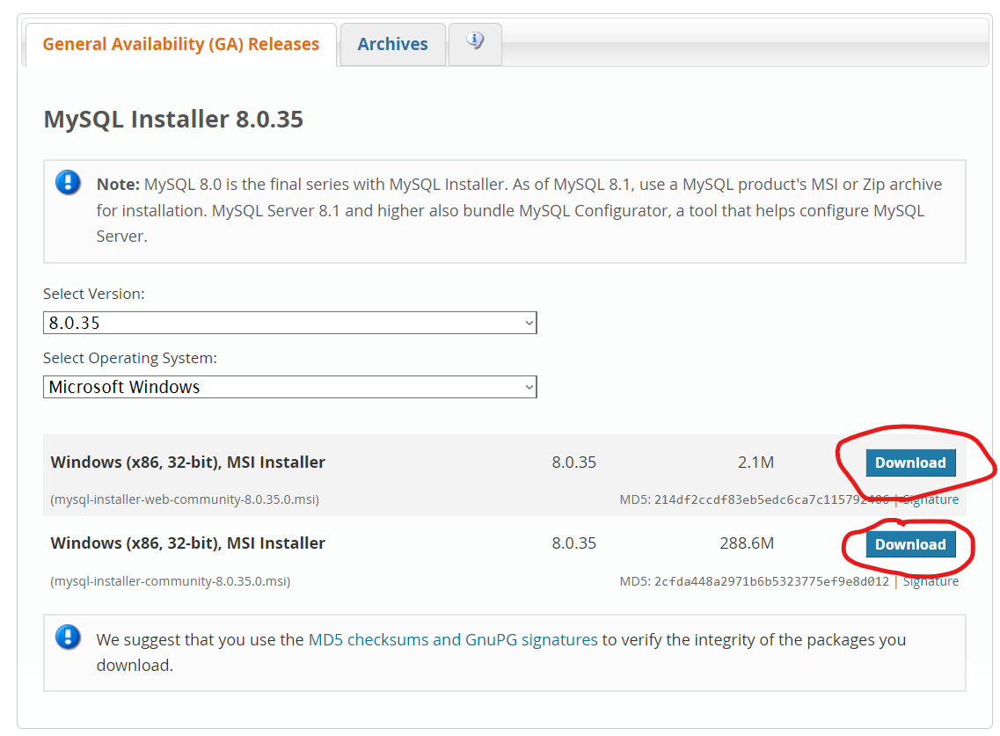

Explications pour le début du TP S01E02:

Allez là où est situé votre langage PHP

pour le trouver on peut :
allez dans la console (CMD ou Console de PHPStorm)
faire la commandes:

php -i | findstr "php.ini"
ou
php -i | grep "php.ini"
qui va permettre trouver le chemin absolu vers le php.ini

renommez votre fichier php.ini-development en php.ini, sauf si vous avez deja un php.ini, puis écrivez à la fin (avec nano ou autre éditeur)
/* Refaire ce qui est au dessus*/

```ini
memory_limit = 512M
max_execution_time = 60
upload_max_filesize = 50M
date.timezone = "Europe/Paris"
```


certaines méthodes requiert "d'importer" des extensions, nous allons utiliser curl, toujours dans php.ini, ajouter cette ligne à la suite des extensions:

extension=php_curl.dll

Attention : php va chercher les extensions à partir de C:\php par défaut sur windows

Le tp peut être fait apres ça


Installation de MySQL:


to do :
class method that connects to your DB using PDO (use MySQL), creates a table, inserts some data into it, and then reads and returns it
a tester chez tout le monde !!


class method that outputs HTTP headers to redirect (HTTP 302) to another script (add a link to your script)

class method that returns an array containing the name of the current host, server and client IP, and request method

class method that returns the currently passed HTTP GET value named test
